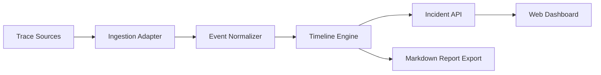

# Architecture

## Components

## Backend

The backend is intentionally simple in the MVP:

- `models.py`: typed incident event models.
- `timeline.py`: deterministic analysis and grouping logic.
- `repository.py`: loads bundled sample data.
- `main.py`: FastAPI endpoints.

The first version avoids databases so contributors can run it quickly. A future version can add SQLite/Postgres storage behind the same repository interface.

## Timeline Engine

The timeline engine:

1. Sorts events by timestamp.
2. Groups evidence into phases.
3. Detects obvious contributors from event fields.
4. Produces a concise incident summary.
5. Emits prevention recommendations.

This deterministic core makes the project useful without requiring an LLM key. Later, optional LLM summarization can be added as a plugin.

## Data Contract

Every normalized event has:

- `id`
- `incident_id`
- `timestamp`
- `type`
- `service`
- `severity`
- `title`
- `details`
- `attributes`

Adapters should map external tools into this shape.
